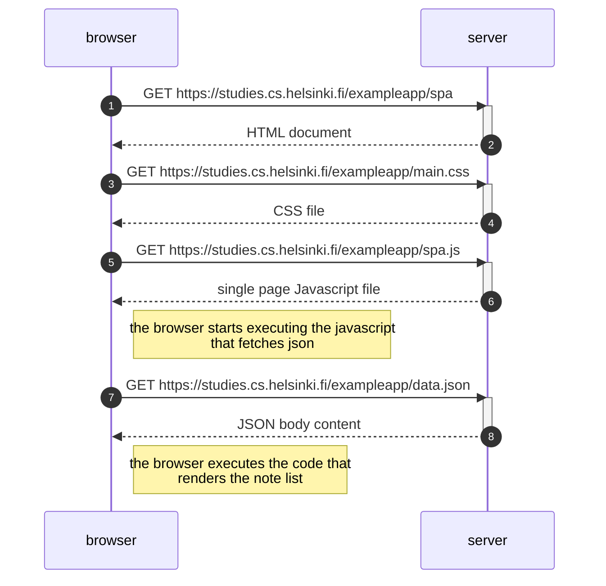

```mermaid
sequenceDiagram
participant browser
participant server
autonumber


browser->>server:GET https://studies.cs.helsinki.fi/exampleapp/spa
activate server
server-->>browser: HTML document
deactivate server

browser->>server: GET https://studies.cs.helsinki.fi/exampleapp/main.css
activate server
server-->>browser: CSS file
deactivate server

browser->>server: GET https://studies.cs.helsinki.fi/exampleapp/spa.js
activate server
server-->>browser: single page Javascript file
deactivate server

Note right of browser: the browser starts executing the javascript <br/> that fetches json
browser->>server: GET https://studies.cs.helsinki.fi/exampleapp/data.json
activate server
server-->>browser: JSON body content
deactivate server
Note right of browser: the browser executes the code that <br/> renders the note list
```
