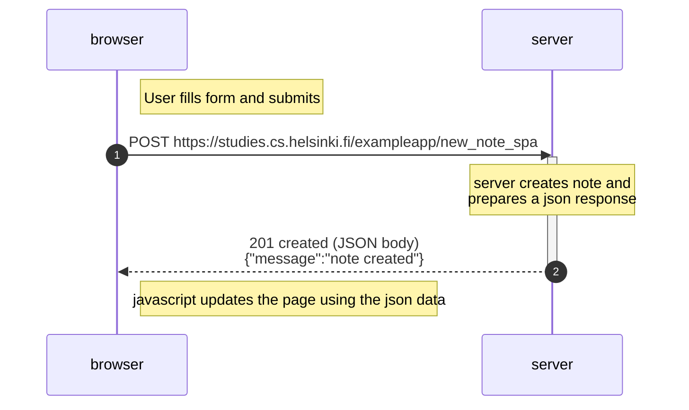

```mermaid
sequenceDiagram
participant browser
participant server
autonumber

Note right of browser: User fills form and submits 
browser->>server: POST https://studies.cs.helsinki.fi/exampleapp/new_note_spa
activate server
Note over server: server creates note and <br/> prepares a json response
server-->>browser: 201 created (JSON body)<br/>{"message":"note created"}
deactivate server
Note right of browser: javascript updates the page using the json data 
```
